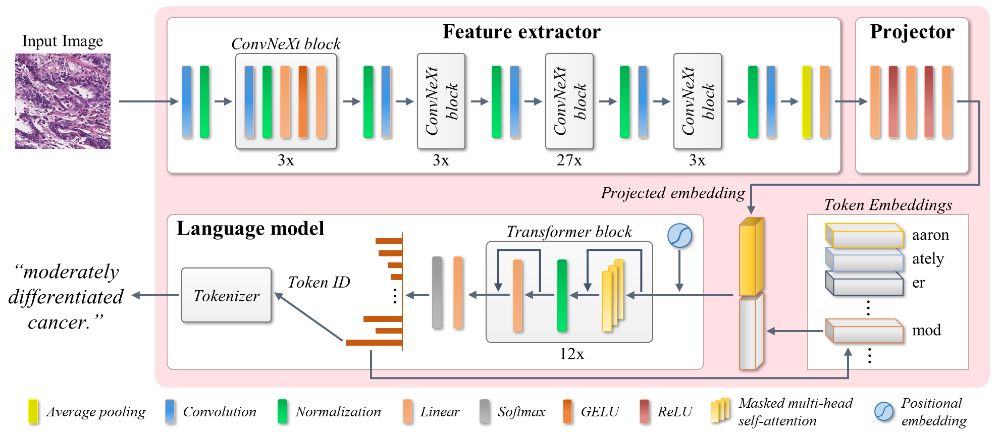
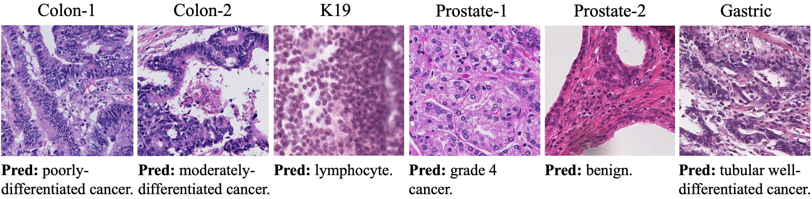
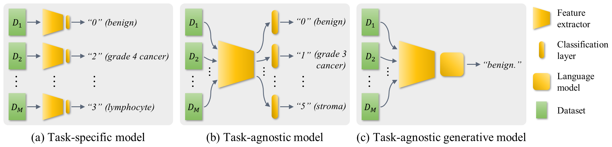

# GPC: Generative and general pathology image classifier

## Overview

Implementation of the paper: 

> **GPC: Generative and general pathology image classifier**
> Anh Tien Nguyen and Jin Tae Kwak
> *MedAGI: MICCAI 2023 1st International Workshop on Foundation Models for General Medical AI*




## Sample predictions




## Environment set up
```
git clone https://github.com/QuIIL/gpc
cd gpc
conda create --name gpc --file requirements.txt
conda activate gpc
pip install -r requirements.txt
```

## Datasets

<ul>
  <li>Colon-1 and Colon-2: <a href="https://github.com/QuIIL/KBSMC_colon_cancer_grading_dataset">link</a> </li>
  <li>Prostate-1: <a href="https://dataverse.harvard.edu/dataset.xhtml?persistentId=doi:10.7910/DVN/OCYCMP">link</a></li>
  <li>Prostate-2: <a href="https://gleason2019.grand-challenge.org/">link</a></li>
  <li>K19: <a href="https://zenodo.org/record/53169">link</a></li>
</ul>


## Experimental settings


<ol>
  <li> <strong>Task-specific:</strong>  models are trained on a training set and tested on the test set(s) per classification task </li>
  <li><strong>Task-agnostic:</strong> models trained on all training sets from four classification tasks and assessed on each test set per task using the corresponding classifier (use only the output of the corresponding branch of testing task) </li> 
  <li><strong>Task-agnostic generative:</strong> model trained on all training sets from four classification tasks and evaluated on the entire test sets</li>
</ol>

## Training

Training GPC with DDP:
```
CUDA_VISIBLE_DEVICES=0,1 python train.py \
    --encoder convnext_large
    --lm facebook/opt-125m
    --out_dir <your_dir>
```

Training a task-specific CNN:
```
python experiment/train_cnn.py \
    --cnn_type resnet50
    --dataset uhu
    --out_dir <your_dir>
```

Training a task-agnostic CNN (multi-branch):
```
python experiment/train_multi_branch.py \
    --cnn_type resnet50
    --dataset prostate_1
    --out_dir <your_dir>
```


### Testing
Testing GPC with DDP:
```
CUDA_VISIBLE_DEVICES=0,1 python test.py \
    --dataset prostate_2
    --pretrain_path <ckpt_path>
```

Testing a task-specific CNN:
```
python experiment/test_cnn.py \
    --dataset prostate_2
    --pretrain_path <ckpt_path>
```

Testing a task-agnostic CNN (multi-branch):
```
python experiment/test_multi_branch.py \
    --dataset prostate_2
    --pretrain_path <ckpt_path>
```